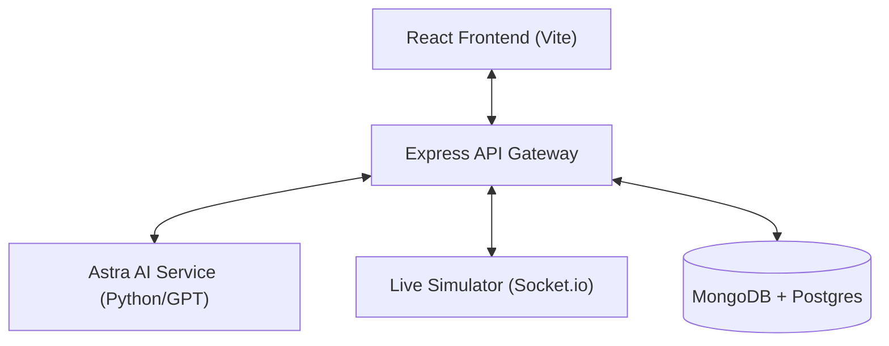

# MASTER DOCUMENTATION: Business Digital Twin Platform

## 1. Executive Summary & Vision
### 1.1 The Concept
**Business Digital Twin** is an AI-first smart simulation platform that enables aspiring entrepreneurs to build a complete digital replica of their future business before investing real capital. It bridges the gap between static business plans and real-world results using high-fidelity modeling and AI-driven analysis.

### 1.2 Core Value Proposition
- **Risk Reduction**: Virtual testing of business models (Price, Rent, Staffing).
- **Astra Intelligence**: Real-time AI advice via semantic reasoning.
- **Micro-Simulations**: Scenario branching (Worst-case vs. Best-case).
- **Investor Readiness**: High-impact financial reports and pitch narratives.

---

## 2. System Architecture & Design
### 2.1 High-Level Architecture
The system utilizes a **Layered Microservices Architecture** with a dual-stack logic layer.

### 2.2 Component Breakdown
- **Frontend (Atomic Architecture)**:
    - **Tokens**: Design system variables for "Mathematical Luxury" aesthetic.
    - **Modules**: `3DEditor`, `AIChat`, `SimulationForge`.
- **Backend (Deep Tech)**:
    - **Security**: JWT-based auth with HttpOnly cookies and Helmet.js security headers.
    - **Real-time**: Socket.io "Physical Pulse" pipeline for live sensor/data simulation.
    - **Intelligence**: OpenAI GPT-4o integration with a high-fidelity "Astra Analysis" fallback.

---

## 3. Data & AI Specifications
### 3.1 AI Architecture
- **Financial Model**: LSTM/Prophet for 24-month time-series forecasting.
- **Risk Model**: XGBoost/Random Forest Classification for business failure probability.
- **RAG Pipeline**: Vector embeddings for context-aware business recommendations.

### 3.2 Database Schema (Mongoose)
- **User**: Identity management with multi-provider (Google/Apple) support.
- **Business**: Persistence of the "Digital Twin" configuration, simulation results, and risk scores.

---

## 4. UI/UX: The "Binary Aura" Aesthetic
- **Concept**: A "Glass Command Center" floating in a digital void.
- **Pillars**:
    - **Transparency**: Backdrop-blur (12px-40px).
    - **Typography**: Space Grotesk (Titles) + Inter (UI) + JetBrains Mono (Technical).
    - **Motion**: Physics-based transitions (Framer Motion).

---

## 5. Development & Scaling
### 5.1 Technology Stack
- **Frontend**: React 18, Vite, Three.js, Tailwind CSS.
- **Backend**: Node.js, Express, MongoDB, Socket.io.
- **AI**: OpenAI API, LangChain.

### 5.2 Scaling Strategy
- **Infrastructure**: AWS ECS Fargate containers for horizontal scaling.
- **Performance**: Redis caching for sessions and AI response vectors.
- **Goal**: Architecture designed to support 1 million concurrent digital twins.

---

## 6. Implementation Roadmap
- **Phase 1 (MVP)**: Business Builder Wizard, Financial 24-month Forecast, Basic AI Advice.
- **Phase 2 (Professional)**: Fully editable 3D Spatial Editor, Real-time Market Data Integration.
- **Phase 3 (Enterprise)**: ML-based optimization engine, White-label solutions for Accelerators.

---

*Contact: Astra Intelligence Team | Built for the future of entrepreneurship.*
