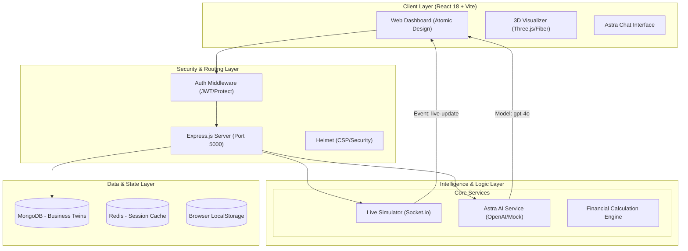

# System Architecture & Design Specification: Business Digital Twin (Deep Dive)

## 1. High-Level System Architecture
The platform follows a **Microservices-ready Monolith** architecture, utilizing a "Dual-Stack" approach for logic and intelligence.



---

## 2. Technical Component Deep-Dive

### 2.1 Security Architecture (Authentication Layer)
The system implements a multi-layered security approach:
- **Identity Provider**: Supports `local`, `google`, and `apple` provider strategies.
- **JWT Implementation**:
    - Tokens issued via `jwt.sign` with a configurable `JWT_EXPIRE` (15m-7d).
    - **Password Security**: Bcrypt with salt rounds: 12.
    - **Session Recovery**: Verification tokens and password-change invalidation checks (iat vs passwordChangedAt).
- **Middleware Chain**:
    1.  `Helmet.js`: Content Security Policy (CSP) customized for Google OAuth.
    2.  `CORS`: White-listed origins for development (`3000`, `3002`, `5173`) and production.
    3.  `Auth.protect`: Extracts token from Authorization header (Bearer) or HTTP-only cookie.

### 2.2 Astra Intelligence Engine (AI Service)
The AI layer is abstracted into a service class (`AIService`) that handles:
- **Context Injection**: Business configurations and financial summaries are serialized into JSON and injected into the prompt.
- **Semantic Reasoning**: Uses `gpt-4o` for high-level strategic advice.
- **Fail-safe Logic**: Implements a "High-fidelity Mock" fallback for environments without API keys, providing simulated "Astra Analysis" vectors (e.g., `PROFITABILITY_VECTOR_MAPPED`).

### 2.3 Real-time Simulation Pipeline
The `liveSimulator` utility simulates physical business data:
- **Transport**: WebSockets via `Socket.io`.
- **Interval**: 10,000ms "Physical Pulses".
- **Payload Structure**:
    ```json
    {
      "type": "PHYSICAL_SYNC",
      "data": {
        "currentFootTraffic": 1-10,
        "liveSales": 5.00-55.00,
        "sensorStatus": "OPTIMAL",
        "variance": "+/- 5%"
      }
    }
    ```

---

## 3. Data Model Specification (Schema)

### 3.1 User Entity
| Field | Type | Description |
| :--- | :--- | :--- |
| `name` | String | Max 50 chars. |
| `email` | String | Unique, validated regex. |
| `password`| String | Hashed, hidden from queries. |
| `role` | Enum | `user`, `admin`, `investor`. |
| `status` | Enum | `active`, `locked`, `suspended`, `unverified`. |

### 3.2 Business Twin Entity
| Field | Type | Description |
| :--- | :--- | :--- |
| `user` | ObjectId | Reference to Owner (1:1 constraint). |
| `config` | Object | Raw input parameters from Builder. |
| `summary` | Object | Processed ROI, Break-even, Cash flow. |
| `risks` | Object | Scoring and mitigation data. |
| `insights`| Array | Historical AI-generated suggestions. |

---

## 4. API Endpoint Surface (V1)

| Route | Method | Access | Description |
| :--- | :--- | :--- | :--- |
| `/api/v1/auth/register`| POST | Public | Create new account. |
| `/api/v1/auth/login` | POST | Public | Authenticate and get JWT. |
| `/api/v1/business` | GET | Private | Retrieve current user's twin. |
| `/api/v1/business` | POST | Private | Save/Update digital twin config. |
| `/api/v1/ai/inquiry` | POST | Private | Tactical AI advice request. |
| `/api/v1/data/sim` | GET | Public | Historical dataset retrieval. |

---

## 5. Frontend Architecture & State
- **Framework**: React 18 (Concurrent Mode) + Vite.
- **Styling**: Tailwind CSS v4 + Framer Motion for micro-animations.
- **State Strategy**:
    - **Global**: `Zustand` for UI state (Chat visibility, Simulator toggles).
    - **Server**: `React Query` for data synchronization and caching.
    - **Visualization**: `Three.js` (React Three Fiber) for 3D spatial modeling.

---

## 6. Scaling & Performance Strategy
- **Caching**: Redis integration for session tokens and high-frequency AI responses.
- **Database**: MongoDB Indexing on `user_id` and `businessType` for O(1) retrieval.
- **Infrastructure**: AWS ECS Fargate for specialized Node.js and Python (ML) container scaling.
- **Resilience**: Error boundary middleware and "Circuit Breaker" pattern for external API calls (OpenAI).
